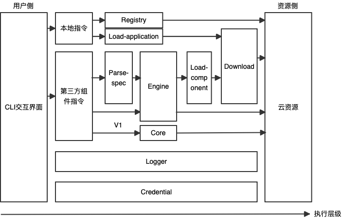

# toolkit for serverless-devs



### [@serverless-devs/downloads](./packages/downloads/README.md)

- 下载，支持文件解压等功能

### [@serverless-devs/load-application](./packages/load-application/README.md)

- 下载应用, 仅适用于serverless源的应用。
  
### [@serverless-devs/engine](./packages/engine/README.md)

- 核心，掌管所有第三方组件命令的具体执行。

### [@serverless-devs/parse-spec](./packages/parse-spec/README.md)

- 配置文件解析，任务编排，处理后交由Engine执行。

### [@serverless-devs/logger](./packages/logger/README.md)

- 掌管全局日志的输入和输出，读取和写入。

### [@serverless-devs/credential](./packages/credential/README.md)

- 全局身份认证。

### [@serverless-devs/load-component](./packages/load-component/README.md)

- 从下载源中下载特定组件。目前只保留了serverless registry源

### [@serverless-devs/registry](./packages/registry/README.md)

- Serverless Registry内容管理

## 开发

```shell
npm run install:all #依赖安装
npm run build #编译所有包
npm run test #测试
```

## 发布

### 本地beta发布测试

- 修改package.json中的版本号，格式为`x.x.x-beta.x(如0.0.1-beta.1)`
- 使用`pnpm publish --tag=beta`发布到npm。

### 发布到npm

- 修改package.json中的版本号。
- 提pr到main。确保通过ci。
- 合并后，将触发流水线自动发布。

### Github Release

- 打tag并上传，格式为`xxx(包名，如engine)@x.x.x(版本号，如0.0.1)`。
- 将自动触发流水线进行release。
